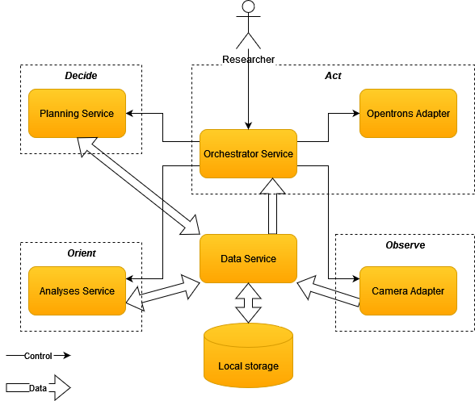

# Self-driving laboratory simulator for the interfacial surface tension use-case

This project showcases a high-level architecture for a self-driving laboratory using the [INTERSECT Open Architecture](https://doi.org/10.1007/978-3-031-23606-8_11) and [SiLA 2](https://sila-standard.com/) laboratory automation standard. The demonstrator is designed to determine the optimal concentration of sodium dodecyl sulfate (SDS) in water to achieve a target interfacial surface tension using the [pendant drop tensiometry method](https://doi.org/10.1016/j.jcis.2015.05.012).

## Table of Contents
* [General Info](#general-information)
* [Technologies Used](#technologies-used)
* [Screenshots](#screenshots)
* [Setup](#setup)
* [Running The simulator](#running-the-simulator)
* [Architecture](#architecture)
    * [High Level Architecture](#high-level-architecture)
    * [Microservice Architecture](#microservice-architecture)

## General Information
The goal of this project is to determine how well the INTERSECT Open Architecture aligns with the goals of the RobotLab project. The INTERSECT open architecture describes an open federated architecture networked system of SDLs and instruments that work together to conduct and analyse experiments autonomously. The assessment is conducted by applying the architecture to one of RobotLab's experimental use cases. The interfacial surface tension use case from Radboud University was selected for its clarity and advanced development stage.
The development of the demonstrator is done with the help of the SiLA standard for laboratory automation. It provides interoperability and flexibility for the integration of laboratory instruments and software services based on standardised communication protocols and data specifications. For the implementation of these microservices certain snippits are borrowed from the team at Radboud in order to increase the realism of the simulation.

## Technologies Used
This project utilizes the following packages, among others:
- [SiLA 2 python implementation](https://sila2.gitlab.io/sila_python/) to create the microservces 
- [Prefect workflow orchestration](https://pypi.org/project/prefect/) to visualize the workflow.
- [opencv-python](https://pypi.org/project/opencv-python/) To generate and analyse the pendant drop images.

## Screenshots

## Setup

To get started with this project first this project must be cloned from GitLab.

`git clone https://git.fhict.nl/coe-htsm/sdl-surface-tension-simulator.git`

CD into the directory

`CD sdl-surface-tension-simulator`

Install the requirements.

`pip install -r requirements.txt`

## Running The simulator

(Optional) Start the Prefect server in another terminal. This server is hosted at [127.0.0.1:4200](127.0.0.1:4200)

`prefect server start`

Start the orchestrator which contains the user interface of the demonstrator.

`python orchestrator.py`

## Architecture

### High Level Architecture
The architecture for this demonstrator is defined in a high-level architecture using the architectural patterns defined by the [INTERSECT Use Case Design Patterns](https://doi.org/10.2172/2229218). These patterns present overall control, data, and work flow, but not detailed control messages, data transfers, and orchestration.

### Microservice Architecture
The microservice architecture implements the components described in the high-level architecture and uses the patterns described in the [INTERSECT Microservice Architecture](https://doi.org/10.2172/2333815). The orchestrator can be compared to the controller in the high-level architecture. Instead of recieving data from the services, the orchestrator tells these services where to store their data.

## Room for Improvement
* Vertical scaling factor for image generation can sometimes be sub-pixel.

## Acknowledgements
Thanks to:
* The Robotlab team from Radboud University for providing their use case and the great feedback.
* The Robotlab team from Fontys for thier great assistance.
* Peter Lambooij for his technical, chemical and mathmatical expertise and guidance. 
* Lars van den Brandt for this for his enthusiastic engagement, assistance, and collaboration.  